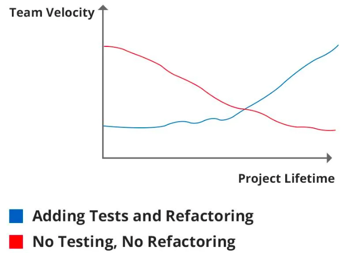

## Varför testning?

- Säkerställer kvalitet och funktionalitet
- Förebygger buggar och felaktigheter
- Underlättar refaktorisering och underhåll
- Fungerar som dokumentation
- Ökar utvecklarnas självförtroende

---



---
## Velocity och Projekttid

- **Utan tester:** Snabb start, men avtagande hastighet
- **Med tester:** Långsammare start, men ökande hastighet över tid

---

## Test-Driven Development (TDD)

### Red-Green-Refactor-cykeln

1. **Red:** Skriv ett test som misslyckas
2. **Green:** Implementera minsta möjliga kod för att klara testet
3. **Refactor:** Förbättra koden utan att ändra dess beteende

---

## Fördelar med TDD

- Fokuserar på kravspecifikation
- Leder till modulär och testbar kod
- Minskar debugging-tid
- Ökar kodkvalitet och minskar teknisk skuld

---

# Introduktion till Testning och TDD

[Tidigare slides behålls...]

---

## Testtyper och Verktyg

1. Enhetstester: Jest
2. Integrationstester: Supertest med Jest
3. Komponenttester: React Testing Library
4. End-to-end-tester: Cypress och Playwright

---

## Enhetstester med Jest

- **Beskrivning:** Testar enskilda funktioner eller metoder i isolation
- **Syfte:** Säkerställa att varje byggsten i koden fungerar korrekt
- **Verktyg:** Jest

**Exempel:**

```javascript
// math.js
export function add(a, b) {
  return a + b;
}

// math.test.js
import { add } from './math';

describe('Math functions', () => {
  test('adds two numbers correctly', () => {
    expect(add(2, 3)).toBe(5);
    expect(add(-1, 1)).toBe(0);
    expect(add(0, 0)).toBe(0);
  });
});
```

---

## Integrationstester med Supertest och Jest

- **Beskrivning:** Testar hur olika moduler eller tjänster fungerar tillsammans
- **Syfte:** Upptäcka problem i interaktionen mellan olika delar av systemet, särskilt i API:er
- **Verktyg:** Supertest (tillsammans med Jest)

**Exempel:**

```javascript
// app.js
const express = require('express');
const app = express();

app.get('/api/users', (req, res) => {
  res.json([{ id: 1, name: 'Alice' }, { id: 2, name: 'Bob' }]);
});

module.exports = app;

// app.test.js
const request = require('supertest');
const app = require('./app');

describe('GET /api/users', () => {
  it('responds with json containing a list of users', async () => {
    const response = await request(app)
      .get('/api/users')
      .expect('Content-Type', /json/)
      .expect(200);
    
    expect(response.body).toHaveLength(2);
    expect(response.body[0]).toHaveProperty('name');
  });
});
```

---

## Komponenttester med React Testing Library

- **Beskrivning:** Testar React-komponenter från ett användarperspektiv
- **Syfte:** Säkerställa att komponenter renderas och beter sig korrekt
- **Verktyg:** React Testing Library

**Exempel:**

```jsx
// Button.js
import React from 'react';

const Button = ({ onClick, children }) => (
  <button onClick={onClick}>{children}</button>
);

export default Button;

// Button.test.js
import React from 'react';
import { render, fireEvent } from '@testing-library/react';
import Button from './Button';

test('calls onClick prop when clicked', () => {
  const handleClick = jest.fn();
  const { getByText } = render(<Button onClick={handleClick}>Click me</Button>);
  
  fireEvent.click(getByText('Click me'));
  
  expect(handleClick).toHaveBeenCalledTimes(1);
});
```

---

## End-to-end-tester med Cypress

- **Beskrivning:** Testar hela applikationen från start till slut, simulerar verklig användarinteraktion
- **Syfte:** Verifiera att alla systemkomponenter fungerar korrekt tillsammans i en produktionsliknande miljö
- **Verktyg:** Cypress

**Exempel:**

```javascript
// cypress/integration/todo_spec.js
describe('Todo App', () => {
  it('should add a new todo item', () => {
    cy.visit('http://localhost:3000');
    
    cy.get('[data-testid="new-todo"]').type('Buy groceries');
    cy.get('[data-testid="add-todo"]').click();
    
    cy.get('[data-testid="todo-list"]')
      .should('contain', 'Buy groceries');
    
    cy.get('[data-testid="todo-count"]')
      .should('contain', '1 item left');
  });
});
```

---

## End-to-end-tester med Playwright

- **Beskrivning:** Automatiserar och testar webbapplikationer i olika webbläsare
- **Syfte:** Säkerställa konsekvent beteende över olika plattformar och webbläsare
- **Verktyg:** Playwright

**Exempel:**

```javascript
// tests/e2e.spec.js
const { test, expect } = require('@playwright/test');

test('user can log in and see dashboard', async ({ page }) => {
  await page.goto('https://example.com');
  
  // Logga in
  await page.fill('#username', 'testuser');
  await page.fill('#password', 'password123');
  await page.click('#login-button');
  
  // Verifiera att användaren är på dashboard
  await expect(page.locator('#welcome-message')).toContainText('Welcome, Test User');
  await expect(page.locator('#dashboard-title')).toBeVisible();
});
```

---
## Best Practices

- Skriv läsbara och underhållbara tester
- Använd beskrivande testnamn
- Håll tester små och fokuserade
- Sträva efter hög testtäckning
- Automatisera testkörning i CI/CD-pipeline

---

## Sammanfattning

- Testning är en investering i kodens kvalitet och projektets framtid
- TDD främjar bättre design och mer pålitlig kod
- Rätt verktyg och metoder gör testning effektiv och värdefull

---

## Frågor?